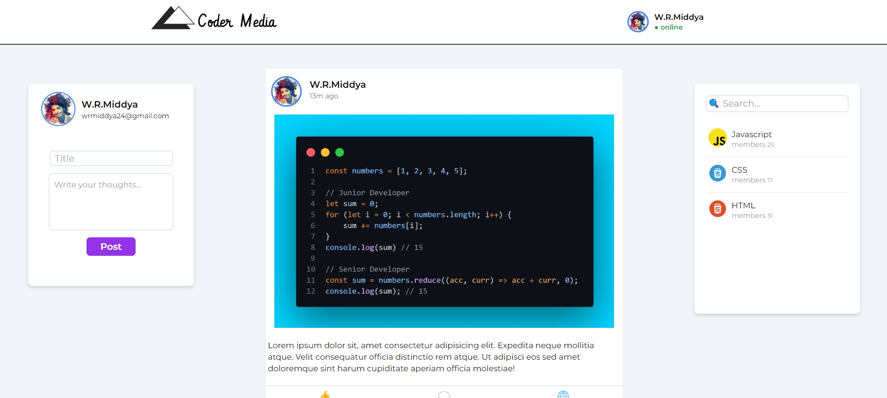

# Coder Media
A lightweight social media web application for learning purpose

<div>
    
</div>

### Installation

1. Open `coder-media` project
2. Locate `$cd client` directory
3. Install modules by using commands

```sh
    $ npm install
```

OR

```sh
    $ yarn
```

4. Run application using

```sh
    $ npm run dev
```

OR

```sh
    $ yarn dev
```

**_NOTE:_** This project uses React with Typescript feature, for better consistency and collaboration and may use more 3rd party libraries.
